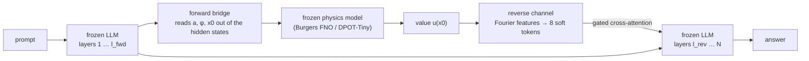

<p align="center"></p>

<p align="center"><b>ΨLM — a frozen language model and a frozen physics model, coupled through latent bridges, producing one answer.</b></p>

## What PsiLM is

PsiLM takes two pretrained models that are never fine-tuned — a language model
and a physics model (a neural operator solving a PDE) — and runs them as one
system. A small trainable *forward bridge* reads the physics model's inputs out
of the language model's hidden states; the physics model computes; a *reverse
channel* returns the looked-up value as soft tokens injected into a later layer
of the language model. No text crosses the interface. The framing is the
brain's two hemispheres cooperating across the corpus callosum: two
specialists, one output. Why it matters: the physics model's answer arrives
*inside* the language model's reasoning — a 12B model that scores 0% on the
field-value question below answers it at 96.7% with the same weights — and a trained
gate keeps the channel shut when physics is irrelevant, so on everything else
the coupled model is the backbone, byte for byte.



The name: Ψ is the wave function, and the coupling is a nod to complementarity — the language model sees the particle-like, verbalized reading of a process whose wave-like description lives in the physics model. The analogy is a motivation, not a claim.

## What it does today

Task: "u(x,0) = a·sin(2πx+φ) evolves by Burgers' equation (ν = 0.02) until
t = 0.5; what is u at x0?" — 60 held-out questions, correct within ±0.05.
*LLM alone* is the backbone by itself, *oracle* is the backbone with the answer
stated in the prompt (the ceiling the channel is measured against). *Gate
selective?* says whether the gate was also trained to stay shut on non-physics
prompts (the guard-rail below).

| backbone | LLM alone | **PsiLM** | oracle | gate selective? | result file |
|---|---:|---:|---:|---|---|
| Qwen2.5-0.5B (fp16, torch) | 8.3% | **100%** | 100% | not trained | `results/stage2/final_eval.json` |
| Qwen3-1.7B (fp16, torch) | 1.7% | **93.3%** | 96.7% | not trained | `results/stage2_qwen3-1.7b/final_eval.json` |
| Qwen3-8B-4bit (MLX) | 6.7% | **95.0%** (98.3% before selectivity training) | 100% | **yes** | `results/stage2_mlx8b9/final_eval_summary.json` (98.3%: `results/stage2_mlx8b8/final_eval_summary.json`) |
| Gemma 4 12B-4bit (MLX) | 0%[^gemma0] | **96.7%** | 98.3% | **yes** | `results/stage2_gemma12b/final_eval.json` |
| Gemma 4 12B-4bit, multi-mode ICs | 20.8% | **100%** in-distribution[^mm] | 100% | **yes** | `results/stage2b_gemma12b_2b/final_eval.json` |
| Gemma 4 12B-4bit, 2D Fisher-KPP (DPOT-Tiny) | in progress | in progress | in progress | — | `results/stage2d_gemma12b_2d/` (pending) |

**Guard-rail** (n = 100 per dataset, `results/bench/*_summary.json`): with the
selective gate the coupled model equals its backbone on GSM8K (Qwen3-8B 89% →
89%, Gemma 84% → 84%) and MMLU (60% → 61%, 53% → 55%), with the gate open on
0% of non-physics prompts and 100% of physics prompts; before selectivity
training the 8B's gate was open everywhere and GSM8K fell from 89% to 34%
(`v8_8b_guardrail_summary.json`).[^mae]

[^gemma0]: Under the text-only protocol Gemma never reaches an "Answer:" line
within 768 tokens (`answer_line_rate` 0.0 in the file), so the backbone-alone
arm scores 0% and MAE is reported against its last number.
[^mm]: Multi-mode families (n=48 each, `results/stage2b_gemma12b_2b/final_eval.json`):
in-distribution 100% (MAE 0.009), the held-out mode combination 25.0% (MAE
0.123) and amplitude extrapolation 52.1% (MAE 0.086), against a backbone of
20.8% / 16.7% / 10.4% and an oracle of 100% on all three. The FNO is exact on
every family (MAE 0.0008), so the two generalization gaps are the readout's:
19 of 48 combination answers match a *single*-mode field value, and on
extrapolation the implied amplitude is below the true one for 71% of items
(median ratio 0.68, inside mode 1's training range). A second run with a span
readout and mode-shared heads is training; the row will be updated with it.

[^mae]: The same files carry MAE: PsiLM 0.014 / 0.022 / 0.021 / 0.017 for the
four backbones, oracle 0.003 / 0.021 / 0.003 / 0.007. Full tables, per-arm
protocols and the earlier 0.5B results (multi-mode generalization, loop
coupling, 2D with DPOT-Tiny at 95.0%) are in
[docs/technical-notes.md](docs/technical-notes.md).

## What it costs and what it buys

Measured end to end on one Apple M2 (24 GB) with the largest backbone in the
table above.

| component | parameters | on disk | trained? |
|---|---:|---:|---|
| Gemma 4 12B-it, 4-bit MLX (language tower) | 12.28B | 6.3 GB | **frozen** |
| PsiLM bridges, one (backbone, task) pair | **25.5M** | 102 MB | **trained** |
| Burgers FNO, the physics hemisphere | 0.07M | 0.55 MB | frozen, pretrained |
| DPOT-Tiny, 2D task only | 7.5M | 30 MB | frozen, fine-tuned |

The trained part is **0.21% of the backbone's parameters** and 1.6% of its
checkpoint size. The 12.28B never move.

| Gemma 4 12B, n = 100 per dataset | alone | **+ PsiLM** | injection zeroed | gate σ |
|---|---:|---:|---:|---:|
| physics QA | 0% | **97%** | 10% | 0.144 |
| MMLU, 5 subjects | 53% | 55% | 53% | 0.008 |
| GSM8K | 84% | 84% | 84% | 0.004 |
| physics, seconds per question | 77.0 (768 tokens) | **3.14** (16.9 tokens) | — | — |
| GSM8K, seconds per question | 25.07 | 25.06 | — | — |

**+0.21% parameters and +103 MB turn 0% into 97%, at 24× lower latency on the
task, with nothing measurable lost elsewhere.** The last column is why the
middle rows do not move: the gate's σ is 0.14 on physics against 0.004–0.008 on
everything else, so the channel is shut when physics is irrelevant. Zeroing the
injection collapses physics to 10% — the accuracy arrives through the bridge,
not through the prompt.

Sources: `results/bench/gemma12b_guardrail_summary.json` (accuracy, gate σ and seconds per question), `results/stage2_gemma12b/final_eval.json` (n=60 held-out: PsiLM 96.7%, oracle 98.3%). Parameter counts are read from the checkpoint headers, not from the model names. The backbone's 0% is its own text protocol: it spends the whole 768-token budget deriving and never commits to an answer line; forcing it to answer (n=8 probe) also gives 0%, with its predictions clustered at 0.41/0.51 while the truths span [-0.56, +0.58]. The latency gap has the same cause — PsiLM answers in one line.

## Products

Backbones and physics models are public models loaded separately; **the bridges
are what PsiLM adds** (3.5M–28.4M parameters per backbone/task pair, and they
do not transfer between backbones).

- **[`ryoji-info/PsiLM-bridges`](https://huggingface.co/ryoji-info/PsiLM-bridges)** — bridge checkpoints (safetensors + `config.json`) for every backbone/task pair in the table above, plus the Stage-1 Bicameral reproduction.
- **[`ryoji-info/PsiLM-physics`](https://huggingface.co/ryoji-info/PsiLM-physics)** — the frozen physics hemispheres: `fno_burgers_singlemode`, `fno_burgers_multimode` (70K-param FNOs) and `dpot_tiny_fisher2d_finetuned` (DPOT-Tiny, 7.5M, from [hzk17/DPOT](https://huggingface.co/hzk17/DPOT)).
- **[`ryoji-info/Gemma-4-12B-PsiLM`](https://huggingface.co/ryoji-info/Gemma-4-12B-PsiLM)** — the standalone release: Gemma 4 12B-4bit bridges, the FNO and a one-file inference script, for running the coupled model without this repository.
- **Paper** — [`paper/psilm.pdf`](paper/psilm.pdf) (19 pages; Section 9 covers scaling, the guard-rail and Gemma).

The three repos are being made public by the maintainer; until then they are private.

## Quickstart

Apple Silicon, 24 GB unified memory is the reference platform (everything here
ran on one M2). Python ≥ 3.11.

```bash
git clone https://github.com/ryoji-info/PsiLM && cd PsiLM
python3 -m venv .venv && source .venv/bin/activate
pip install -e ".[stage1]"            # mlx, mlx-lm, numpy, torch, transformers (pyproject.toml)
pip install datasets huggingface_hub  # GSM8K/MMLU guard-rail benchmarks and Hub downloads
```

Tested with mlx 0.32.2, mlx-lm 0.31.3, transformers 5.16.1 and torch 2.13.0;
the Gemma 4 loader goes through mlx-lm internals, so pin `mlx-lm==0.31.3` if a
newer release breaks it.

**Run inference** with the standalone Gemma-4-12B-PsiLM release (built under
`release/gemma-4-12b-psilm/` here, mirrored to the Hugging Face repo above;
the backbone downloads on first use):

```bash
cd release/gemma-4-12b-psilm
python psilm_infer.py --a 1.28 --phi 0.5 --x0 0.76
```

It prints three results: the PsiLM answer, the backbone-alone answer, and the
physics model's own value of u(x0), so you can see the coupled model verbalize
what the operator computed. The `pip install -e` above makes the `psilm`
package importable; without it, set `PSILM_REPO=/path/to/PsiLM`. The same
checkpoint (`results/stage2_gemma12b/bridges.npz`) evaluates on the 60
held-out questions from the repository root with

```bash
python eval/mlx_stage2_eval.py --model mlx-community/gemma-4-12B-it-4bit \
  --hf-tokenizer mlx-community/gemma-4-12B-it-4bit --tag _gemma12b --n 60 --out final_eval_repro.json
```

(`--out` keeps the committed `final_eval.json` intact; the new file lands in
`results/stage2_gemma12b/`).

**Reproduce a training run** (Gemma 4 12B, batch 4, 12 s/step at a 13 GB peak;
the FNO `results/stage2/fno.pt` and the no-harm prompts `data/noharm_gemma_all.json`
are committed):

```bash
python eval/mlx_stage2_train.py --model mlx-community/gemma-4-12B-it-4bit \
  --hf-tokenizer mlx-community/gemma-4-12B-it-4bit --tag _gemma12b --steps 500 --batch 4 --lr 3e-4 \
  --readout-only 2000 --readout-norm dim --calib-n 32 --channel value --inj-cap 0.2 --gate-bias 0.0 \
  --lam-x0 1.0 --clip module --detach-x0 --eval-n 48 --fresh
```

Repeat without `--fresh` until step 5,500 (11 chunks of 500 in all: 2,000
readout-only steps, then 3,500 coupled), then three chunks at `--lr 1e-4` with `--noharm-data
data/noharm_gemma_all.json --noharm-every 2 --noharm-gate-only 1 --lam-gate 1.0`
for the selective gate (step 7,000 is the committed checkpoint). The exact
scripts are `results/gemma12b/run_recipe.sh` and `noharm_recipe.sh`;
the Qwen and 0.5B commands are in the [technical notes](docs/technical-notes.md).

## How it works

**Forward bridge (language → physics).** The prompt runs through the frozen
backbone up to layer *l_fwd*. A learned query attention-pools the prompt's
hidden states and a small head regresses (a, sin φ, cos φ) from the pooled
vector; the queried position x0 is read separately, by averaging the hidden
states over x0's token span — the span is supplied by the QA builder, not
learned — and turning that vector into a value with a 100-bin classifier
(softmax expectation). On Gemma the hidden states are first standardized per
dimension with statistics from a 32-prompt calibration pass, because Gemma's
massive-activation dimensions otherwise swamp the digit signal.

**Physics model.** A 70K-parameter Fourier neural operator, pretrained to solve
1D viscous Burgers to 0.28% relative error and then frozen, maps the
reconstructed initial condition to the field at t = 0.5 (DPOT-Tiny plays the
same role for 2D Fisher-KPP).

**Reverse channel (physics → language).** The field is sampled at x0, the
single value is expanded through Fourier features into eight soft tokens, and
a cross-attention block at layer *l_rev* adds them to the residual stream
behind a sigmoid gate, with the injection capped at 20% of the stream.

**Gate and the no-harm arm.** The gate is an MLP on the residual stream,
trained on physics questions (answer cross-entropy plus deep supervision on the
readouts and on u(x0)) *and* on non-physics prompts — GSM8K and MMLU items
paired with the backbone's own continuation — where only the gate receives
gradient and the target is "change nothing". That second arm is what makes it
selective.

Two design rules the 8B campaign taught, each after a failed run: **the channel
must be narrow** — carry only the queried value; a channel carrying the whole
latent field was shortcut to per-trajectory constants (17% → 98.3% after the
swap) — and **a gate is only a gate if it is trained on prompts where it must
close**; trained on physics alone it sat open on every input.

## Read more

- [docs/technical-notes.md](docs/technical-notes.md) — Stage 0 → 2d narratives, the multi-mode generalization and loop-coupling studies, the 2D DPOT result, the eight-run 8B failure analysis, the Gemma calibration fix, the full guard-rail tables, and every reproduce command.
- [paper/psilm.pdf](paper/psilm.pdf) — *PsiLM: Coupling Frozen Language and Physics Models through Trainable Latent Bridges.*
- Nearest prior work: the Bicameral Model ([arXiv:2605.11167](https://arxiv.org/abs/2605.11167)), the Global Latent Workspace line ([shimmer](https://github.com/ruflab/shimmer)), CALM ([arXiv:2401.02412](https://arxiv.org/abs/2401.02412)).

## Beyond physics: what would and would not transfer

PsiLM is a recipe for coupling a frozen language model to a frozen
*quantitative* model, and nothing in the recipe is specific to PDEs. The
language side reads a fixed set of quantities out of the text, the frozen
model computes from them, and a selective gate returns one value into the
language model's reasoning only on questions that model can answer. A
calibrated market model, an event-probability model, or an agent-based
simulator in the physics model's seat would be the same architecture, and
the reason to want it is the same: a language model's forecast grounded in
a model that can be validated separately, with a gate that stays shut when
the model does not apply.

That is the extent of what this repository supports. Everything that made
the physics results possible is absent in markets: every training example
here has an exact oracle, the targets are deterministic, and the test
distribution matches the training one. Prediction markets and asset prices
have no oracle, stochastic targets, and constant distribution shift, so the
training signal would be noisy, calibration would have to be earned by
backtesting rather than assumed, and the guard-rail question ("does the
gate open only when it should?") would become the central problem rather
than a final check. No experiment in this repository touches financial
data, and nothing here is evidence of forecasting performance or a basis
for investment decisions. If someone builds a market model into PsiLM, the
first result worth reporting is the equivalent of this repository's
guard-rail table, not a return.

## Roadmap

| Stage | What | Status |
|---|---|---|
| 0 | Loop-level coupling (LLM extracts → simulator → result back in the prompt); eval harness and baseline arms | done |
| 1 | Bicameral Model reproduction at 0.5B: two frozen twins, trainable gated interface | done |
| 2 | PsiLM proper: frozen LLM ⇄ frozen FNO through latent bridges | done — 100% |
| 2b–2d | Multi-mode ICs, held-out families, loop coupling, 2D physics via DPOT-Tiny | done |
| 3 | MLX port, 4-bit backbones, Qwen3-1.7B and Qwen3-8B | done |
| 4 | Guard-rail benchmarks (GSM8K/MMLU) and the selective gate | done |
| 5 | Second model family, Gemma 4 12B, single-pass recipe transfer | done — 96.7% |
| 5b | Gemma 4 12B on the multi-mode task (in-distribution 100%; generalization families open) | done |
| 5c | Span readout with mode-shared heads, for the two generalization families | in progress |
| 6 | 27B inference-only on this machine; loop coupling at 8B; Mac app | planned |

## Support

PsiLM is independent research, run on a single Apple M2. If it is useful to
you, you can support the work at
[ko-fi.com/ryojifurui](https://ko-fi.com/ryojifurui).

## Citation

```bibtex
@misc{furui2026psilm,
  title  = {PsiLM: Coupling Frozen Language and Physics Models through Trainable Latent Bridges},
  author = {Furui, Ryoji},
  year   = {2026},
  month  = sep,
  url    = {https://github.com/ryoji-info/PsiLM},
  note   = {Research generated by Claude Fable 5 (Anthropic) under the author's direction}
}
```

## License

Apache-2.0. DPOT-Tiny derives from [hzk17/DPOT](https://huggingface.co/hzk17/DPOT) (Apache-2.0).

*AI generation disclosure: this research was designed, implemented, run and written up by Claude Fable 5 (Anthropic) under the direction and review of Ryoji Furui; see the paper's AI Generation Disclosure (Section 12).*
